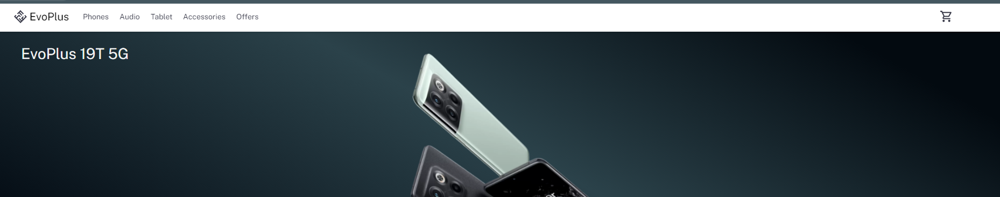

### Descripción:

Este repositorio de ejemplo es un proyecto de e-commerce desarrollado con React y la biblioteca React Bootstrap. Este proyecto fue realizado con: `npm create vite@latest`.

 - Para instalar las dependecias  del proyecto debe escribir en la consola: `npm install`
 - Y luego para iniciar en el proyecto ejecutar: `npm run dev`
 - Ir a http://localhost:5173/

Puedes acceder aqui para ver la entrega 👇

[EVOPLUS](https://649f7dd213d46c5fe95484f4--starlit-sable-7acd1c.netlify.app/)

