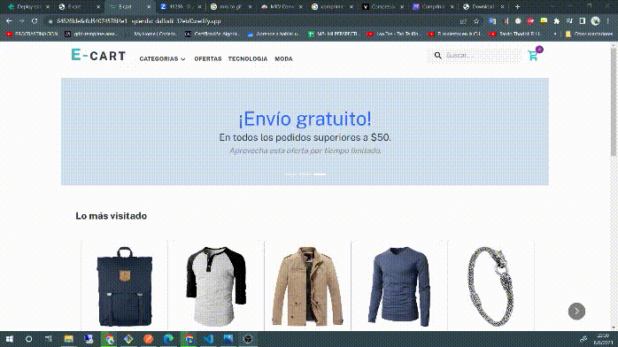

### Descripción:

Este repositorio de ejemplo es un proyecto de e-commerce básico desarrollado con React y la biblioteca Material Design (MUI). Este proyecto fue realizado con: `npm create vite@latest`.

 - Para instalar las dependecias  del proyecto debe escribir en la consola: `npm install`
 - Y luego para iniciar en el proyecto ejecutar: `npm run dev`
 - Ir a http://localhost:5173/

### Pre-entrega2

Puedes acceder aqui para ver el estado actual 👇

[🛒 E-CART](https://64828bfe6c0d54074578f4e1--splendid-daffodil-32ebf0.netlify.app/)

Gif de funcionamiento :

